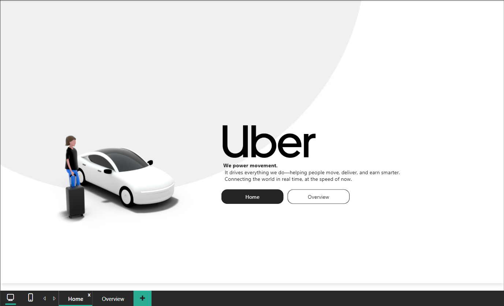
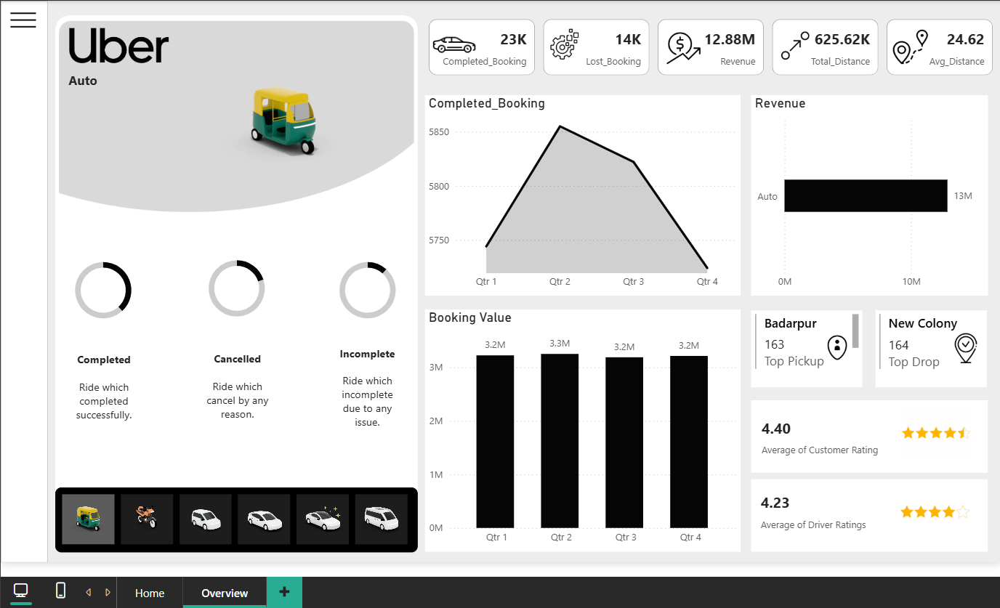
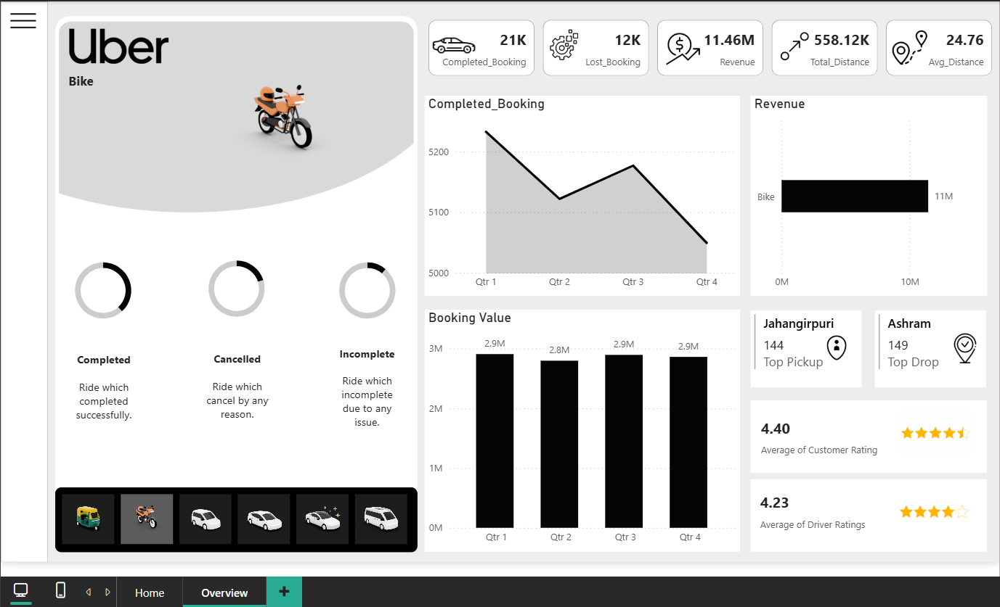
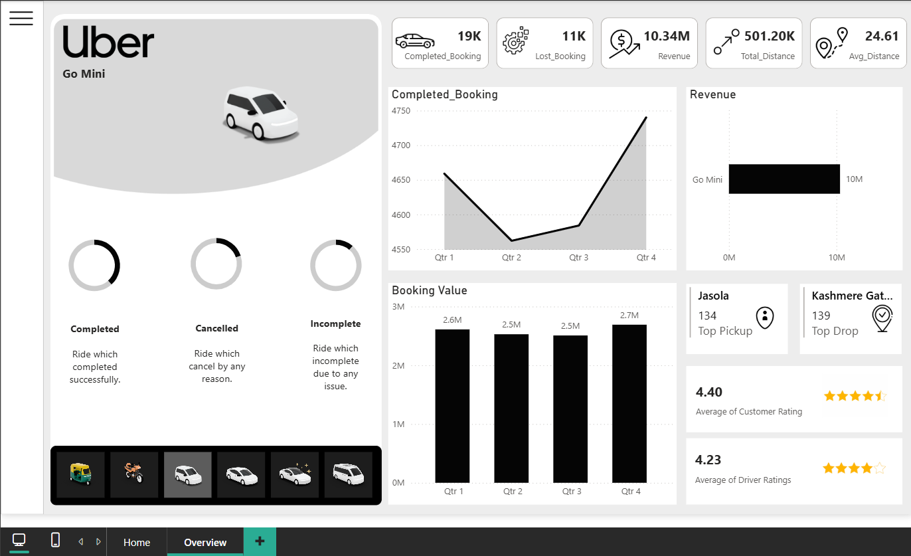
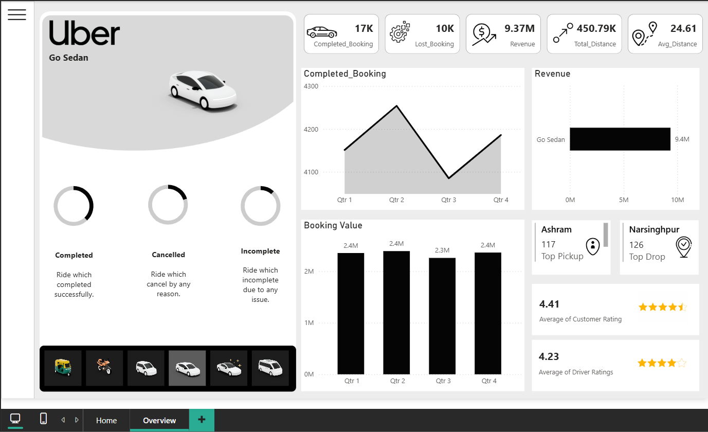
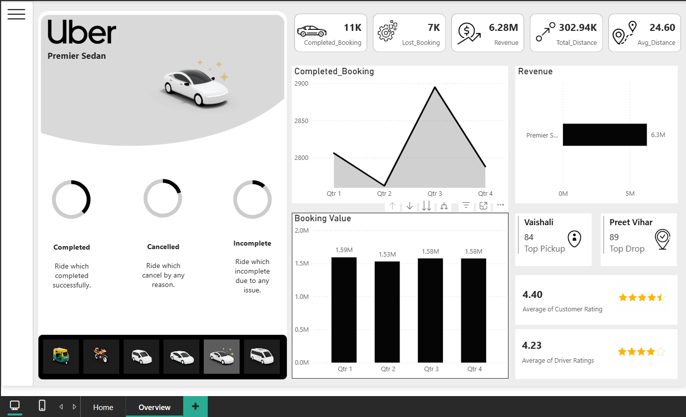
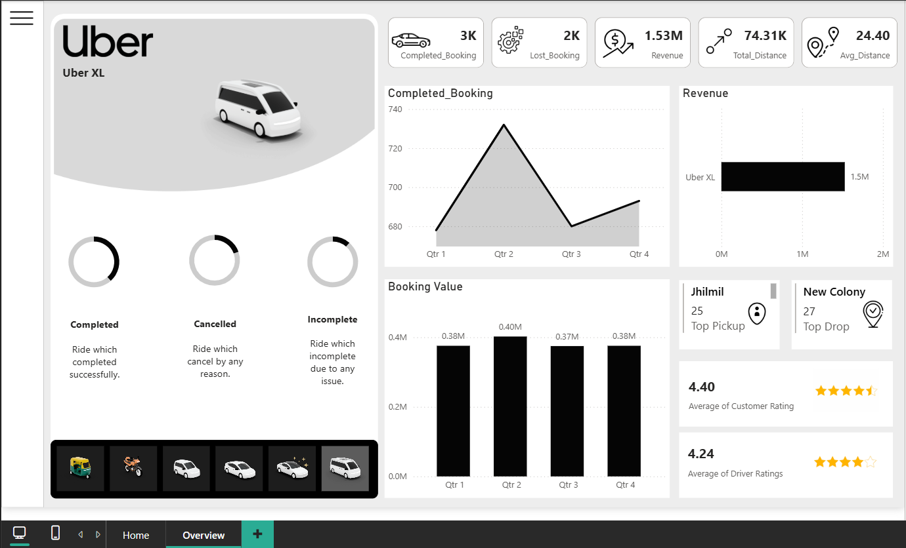

# Uber Ride Analytics Dashboard

## Project Overview

An interactive Power BI dashboard built to analyze Uber ride booking
performance, revenue, distance, ratings, and vehicle-level trends.

The dashboard provides an overview of ride performance and allows users
to explore individual vehicle categories through an interactive vehicle
selector.

## Dashboard

The dashboard contains two main pages:

-   **Home** -- Introduction and navigation to the analysis page.
-   **Overview** -- Interactive analysis of booking performance,
    revenue, distance, ratings, and locations.

## Key Metrics

-   Completed Bookings
-   Lost Bookings
-   Revenue
-   Total Distance
-   Average Distance
-   Customer Rating
-   Driver Rating

## Key Insights

Based on the dataset used for the dashboard:

-   **Auto** recorded the highest revenue among all vehicle categories,
    generating approximately **12.88M** in booking value.
-   **Auto** also had the highest number of completed bookings, with
    approximately **23.2K** completed rides.
-   **Go Mini** was the second-highest vehicle category by revenue,
    generating approximately **10.34M**.
-   **Uber XL** had the lowest booking volume and revenue among the
    vehicle categories, with approximately **2.8K completed bookings**
    and **1.53M** in booking value.
-   Quarterly revenue remained relatively stable, ranging from
    approximately **12.80M to 13.08M**, with **Q4 recording the highest
    revenue**.
-   The overall average customer rating was approximately **4.40**,
    while the average driver rating was approximately **4.23**.
-   **UPI** was the largest payment method by booking value in the
    dataset.

## Analysis

The dashboard provides insights into:

-   Quarterly booking trends
-   Revenue by vehicle type
-   Booking value across quarters
-   Completed, cancelled, and incomplete rides
-   Top pickup and drop locations
-   Customer and driver ratings
-   Vehicle-level performance comparison

## Tools & Technologies

-   **Power BI**
-   **Power Query**
-   **DAX**
-   **Microsoft Excel**

## Dataset

The dataset contains **150,000 ride booking records** with information
related to:

-   Booking date and time
-   Booking status
-   Vehicle type
-   Pickup and drop locations
-   Cancellation reasons
-   Booking value
-   Ride distance
-   Driver ratings
-   Customer ratings
-   Payment method

## Dashboard Preview

### Home Page



## Overview Page


### Vehicle Analysis

#### Auto


#### Bike


#### Go Mini


#### Go Sedan


#### Premier Sedan


#### Uber XL


## Project Structure

``` text
Uber-Ride-Analytics-PowerBI/
│
├── README.md
│
├── Dashboard/
│   ├── Uber-Ride-Analytics.pbix
│   └── Screenshots/
│       ├── Home.png
│       ├── Auto.png
│       ├── Bike.png
│       ├── Go-Mini.png
│       ├── Go-Sedan.png
│       ├── Premier-Sedan.png
│       └── Uber-XL.png
│
└── Data/
    └── Uber_Ride_Data.xlsx
```

## Project Objective

The objective of this project is to transform raw ride-booking data into
an interactive business intelligence dashboard that can be used to
monitor operational performance and identify trends across vehicle
categories.

------------------------------------------------------------------------
